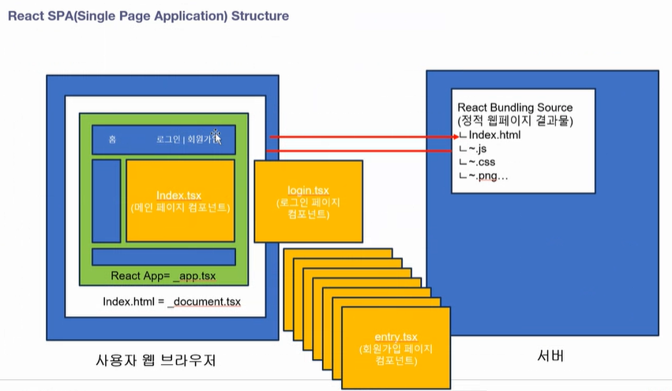

# 2024 여름 5주간의 몰입교육 Web-FullStack-AI-Course

---

## 2024-07-24

### AJAX(Asynchronous Javascript And XML)

- AJAX란, JavaScript의 라이브러리중 하나이며, HTML, CSS, 자바스크립트, DOM, XML 등 기존에 사용되던 여러 기술을 함께 사용하는 새로운 개발 기법입니다.
- 브라우저가 가지고있는 XMLHttpRequest 객체를 이용해서 전체 페이지를 새로 고치지 않고도 페이지의 일부만을 위한 데이터를 로드하는 기법이며, JavaScript를 사용한 비동기 통신, 클라이언트와 서버간에 XML 데이터를 주고받는 기술입니다.
- 즉, 쉽게 말하자면 자바스크립트를 통해서 서버에 데이터를 요청하는 것입니다.
- 참고: [AJAX란?](https://daegwonkim.tistory.com/445)  
        [[비동기 통신] Ajax와 Axios의 차이점?](https://hstory0208.tistory.com/entry/%EB%B9%84%EB%8F%99%EA%B8%B0-%ED%86%B5%EC%8B%A0-Ajax%EC%99%80-Axios%EC%9D%98-%EC%B0%A8%EC%9D%B4%EC%A0%90)

### PUT & PATCH 메소드

PUT과 PATCH 모두 데이터를 수정할 때 사용한다.  
하지만 꼭 수정할 때 PUT 또는 PATCH를 사용할 필요는 없다.  
일반적으로 POST를 등록/수정에 주로 사용한다.

- PUT: 기존의 모든 것을 수정
- PATCH: 일부 부분적인 수정

### 와일드카드

와일드카드를 사용한 라우팅 메서드는 가장 아래에 선언해야 한다.  
그렇지 않으면 aid = 1 = delete?aid=1 이들 모두 같다고 인식한다.

Ex)

- http://localhost:3000/api/articles/1
- http://localhost:3000/api/articles/delete?aid=1

와일드 카드는 주소체계가 같으면 뒤쪽을 값으로 인식한다.

### 미들웨어

응답 전에 미들웨어를 먼저 실행하게 하여 특정 로직을 태운다.  
라우팅 메소드를 호출할 때, 호출 주소와 콜백함수 사이에 미들웨어를 추가한다.  
-> 미들웨어를 통해 로그인 여부를 체크할 수 있다.

참고: [[인프라 뿌시기 #1] 미들웨어, 개념을 알아보자](https://velog.io/@unyoi/%EC%9D%B8%ED%94%84%EB%9D%BC-%EB%BF%8C%EC%8B%9C%EA%B8%B01-%EB%AF%B8%EB%93%A4%EC%9B%A8%EC%96%B4-%EA%B0%9C%EB%85%90%EC%9D%84-%EC%95%8C%EC%95%84%EB%B3%B4%EC%9E%90)

### EJS

- 라우팅 메소드에서 view에 전달된 데이터 출력하려면 =을 쓴다.  
  -> <%=데이터 속성명%>

---

## 2024-07-25

    주의 !  
    views/.ejs 파일의 <%%> 구문은 백엔드 코드  
    routes/.js 파일의 <script> 구문은 프론트엔드 코드

### 시맨틱 태그(Semantic Tag)

- html에서 페이지가 어떤 내용의 영역인지 유추할 수 있도록 태그 이름에 의미를 부여한다.
  사실 div 태그로 해도 상관없다.
- 똑같은 div로 하는 것보다 시맨틱 태그를 사용하는 것이 검색 엔진을 최적화할 수 있다.
  Ex) nav, main, article

### view 화면 컴포넌트 재사용

- Include 방식
  - 각각 물리적인 파일로 존재한다.
  - html 태그 영역, script 태그 영역, css 영역은 여전히 중복된다.
- 레이아웃
  - 레이아웃에는 실제 컨텐츠를 제외한 공통 부분만 포함한다.
  - 레이아웃에서 <%- %> 태그를 이용해 통합한다.
  - <body>, <meta>(검색 엔진 최적화), <style>, <script> html 태그를 적용할 수 있다.

-> 기본적으로는 레이아웃 기술을 사용하고, 레이아웃을 적용해도 중복되는 부분은 부분적으로 Include 파일로 따로 뺀다.

---

## 2024-07-26

### DBMS

데이터 관리 SW 시스템

- RDBMS
  - RDBMS 특징
    - 결함이 없는 데이터를 안정적으로 영구적으로 관리하는 것이 주요 목적
    - 데이터 수가 많으면 RDBMS는 속도가 떨어진다.
    - DB 서버 복제가 오래 걸린다.
    - 속도보다 무결성 데이터 수집을 목적으로 한다 !
    - Constraints(제약사항)을 이용하여 무결성 데이터를 수집한다.(데이터에 결함이 있다면, 에러를 발생시킨다.)
    - Ex) MySQL, MariaDB(MySQL과 유사), PostgreSQL
  - RDBMS 구조
    - Databases - Tables - Rows - Columns
    - TABLE간의 관계 기반 정형 데이터 관리
    - TABLE의 관리 항목은 사용자 관리 항목(제목, 내용 등)과 시스템 관리 항목(ID, 등록일시, IP 등)으로 나뉜다.

- NoSQL
  - 관계형 데이터베이스의 한계를 극복
  - 빠른 응답 속도, 높은 가용성(사용자가 늘어남에 따라 자원(DB 서버)을 늘렸다 줄였다 가능), 확장성(DB 서버를 실시간으로 복제해서 확장하는 것이 자유롭다.
    -> Scale-Up:단일 서버 CPU/메모리 추가, Scale-Out:서버를 추가), 가용성(백업(스탠바이)서버 없이 사용 중에 실시간으로 DB 서버가 늘릴 수 있다.)
  - 데이터 양이 많고(빅데이터), 데이터 구조가 정해져있지 않은 경우 NoSQL을 사용한다.
  - 정형 데이터 방식으로도, 비정형 데이터도 관리할 수 있다.
  - 실시간으로 확장이 가능하다.
  - 트래픽을 예측할 수 없는 경우 사용된다.

- Document DB
  Ex) MongoDB
- KEY-VALUE DB
  Ex) REDIS

---

## 2024-07-29

### MySQL

- Schema(=Database)
- Character Set은 utf8mb4(utf8에 이모지를 포함한 최신 버전)
- collation은 unicode_ci를 선택하면 정렬을 할 수 있다.

- MySQL 데이터 유형
  - 문자형
    - CHAT(고정길이형)
      - 문자열 고정길이는 해당 길이만큼 사이즈를 사용한다.
      - 실제 데이터가 안들어가도, 데이터 길이가 고정된 형태 데이터 입력
      - 길이가 정해져 있는 데이터를 사용할 때 CHAR를 사용한다.
    - VARCHAR(가변길이형)
      - 문자열 가변길이
      - 알파벳 한 글자: 1byte, 유니코드 한 글자: 2byte
    - TEXT
      - 1000자리 이상의 긴 문자열

- MySQL TABLE 제약조건
  - PK(Primary Key)
  - NN(Not Null)
      NULL은 Data가 입력 안된 초기 상태, 공백 문자는 값이 들어가 있다.
  - UQ(Unique Key)
      Primary Key는 Unique Key
  - ZF(Zero Fill)
      남는 공간은 0으로 채운다.
  - AI(Auto Increment)
      자동 증가

### Model

데이터의 구조를 프로그래밍 언어로 표현한 클래스  
물리적인 테이블을 백엔드에서 제어하기 위함

- Data Model: DB의 TABLE과 1대1 매핑된다.
- View Model: 화면의 구조가 기준
- DTO Model: 여러 모델의 데이터를 하나의 모델로 준다.

### ORM

모델과 물리적인 TABLE을 1대1 매핑해 모델을 통해 관리한다.  
ORM 프레임워크에서 동적으로 SQL 쿼리를 만들어준다.

### Code First & Model First

코드로 모델을 만들고, DB를 적용한다.  
새로운 프로젝트를 만들 때 사용한다.

- Database First
  - 만들어진 DB를 바탕으로 코드에 적용한다.
  - 이미 운영 중인 시스템에 사용한다.

### /model/index.js

index.js는 물리적인 데이터베이스 그 자체를 가리킨다.

---

## 2024-07-31

사용자 사이트는 UI/UX도 좋아야 하고, 디자인도 최신 트렌드를 따라가기 위해 프론트와 백엔드를 나눠서 개발하지만,  
관라지 사이트는 디자인을 신경 쓸 필요가 없기 때문에, 백엔드에서 모든 것을 개발하기도 한다.

### Socket.io 모듈

- 클라이언트 -> 서버로 전송한 메시지 수신
  - on 메소드
    현재 접속되어 있는 클라이언트로부터 메시지를 수신하려면 on 메소드를 사용한다.
    - io.on
      - 'connection' : socket.io의 기본 이벤트, 사용자가 웹사이트에 접속하면 자동으로 발생하는 이벤트
    - socket.on - 해당 클라이언트에서 메세지를 보낸다.

- 서버 -> 클라이언트로 메시지 전송
  - emit 메소드
    - io.emit
      - 서버가 현재 접속해있는 모든 클라이언트에게 이벤트 전달
      - io.emit은 연결된 모든 클라이언트를 대상으로 한다.
        -> 따라서 sender인 socket에 해당되는 client에게도 전달된다.
    - socket.emit
      - 서버쪽에서 event를 발생시키는 함수
      - 서버에서 이벤트 발생시키면 클라이언트 페이지의 해당 이벤트 리스너에서 처리
      - 해당 소켓을 통해 클라이언트에게 메시지 전송
      - sender인 socket의 클라이언트는 제외한다.

참고: [[Node.js] Socket.io 모듈 (.emit .on)](https://velog.io/@rzee/Node.js-Socket.io-%EB%AA%A8%EB%93%88-.emit-.on)  
      [Socket.io - io.emit(io.sockets.emit)과 socket.broadcast.emit의 차이](https://velog.io/@nittre/NodeJS-io.emitio.sockets.emit%EA%B3%BC-socket.broadcast.emit%EC%9D%98-%EC%B0%A8%EC%9D%B4)

### CORS

- 같은 서버 도메인이 아닌 다른 도메인에서 데이터를 호출할 때, 차단되어 CORS 이슈가 생긴다.
  -> 동일 출처 원칙을 위반
- 허용된 도메인에 대해서 데이터/소캣 기능을 제공할 수 있도록 CORS 설정이 필요하다.
- 데이터를 제공하는 도메인과 사용하는 도메인이 다르면, 시스템 상에서 차단한다.
- 도메인을 등록하면 사용할 수 있다.
- restful, 채팅 서버에서 CORS 이슈가 많이 발생한다.

### JWT

JSON 형식의 데이터를 암호화해 놓은 토큰

- 토큰을 까보면 JSON 데이터가 들어있다.
- 토큰에 담겨져있는 데이터는 바꿀 수 없다.
  -> 바꾸면 깨져버리기 때문에 안전하다.
- JWT 토큰의 형식
  - HEADER: 토큰 종류와 해시 알고리즘 정보 제공
  - PAYLOAD: 토큰으로 저장하는 실제 데이터인 JSON 데이터를 인코딩하여 저장하는 영역
  - SIGNATURE: 일련의 문자열로 서버에서 발급해준 특정 문자열로 시그니처 값을 통해서 사버의 값과 비교해 토큰이 변조되었는지 여부를 확인할 수 있는 값 설정.
- PAYLOAD 영역에 들어있다.
- 토큰을 만들 때도 인증키가 필요하고, 까볼 때 만들때 사용했던 인증키가 필요하다.(양방향 암호화)

  Q, JWT 토큰을 왜 쓰는가?
  - 용도
    이기종 시스템 간의 데이터 상호교환을 통한 시스템 통합수단으로 사용
  - 오리지널 데이터를 변조없이 주고 받을 수 있다.
  - JWT토큰은 기본적으로 변조 불가능하다.
  - 난독화/복호화 사용이 간편해 각종 시스템간 데이터 교환 표준 포맷으로 사용된다.

  로그인 한 사용자의 정보를 유지한다.  
  로그인을 했는지 안했는지 확인한다.

  - 랜덤한 JWT 토큰 시크릿 키 만들기
    참고: [JWT Secret Key 생성하기](https://velog.io/@5w31892p/JWT-Secret-Key-%EC%83%9D%EC%84%B1)

  - JWT 까보기
    https://jwt.io/
    JWT 토큰에는 공개되도 괜찮은 데이터만 담아야 한다.  
    JWT 토큰이 localStorage에 담겼을 때, 그걸 저 사이트를 통해 까볼 수 있다.  
    JWT를 까봤을 때 중요한 개인정보가 담겼으면, 유출될 수 있다.  
    -> JWT 토큰에 개인정보를 담을 경우, 암호화해서 담아야한다.  

---

## 2024-08-01

### RESTful

Q. REST API와 RESTful API의 차이는 뭘까?  
  RESTful은 REST의 설계 규칙을 잘 지켜서 설계된 API를 RESTful한 API라고 합니다.  
  즉, REST의 원리를 잘 따르는 시스템을 RESTful이란 용어로 지칭됩니다.

참고: [REST란? REST API 와 RESTful API의 차이점](https://dev-coco.tistory.com/97)

라우터 파일은 업무 단위로 나누는 것이 좋다.

---

## 2024-08-02

### 서버 세션

세션(서버 메모리)을 만들어 특정 도메인에셔 발급해준 쿠키를 갖는다.  
브라우저의 헤더에 쿠키가 들어있어, 서버에서는 브라우저에서 요청을 할 때, 토큰을 가져와서 읽어본다.

### 쿠키

- 텍스트 파일
- 서버에서 발급한다.
- 세션을 만들 때 쿠키를 같이 굽는다.
- 세션은 로그인하는 사용자마다 만든다.
- 세션은 고유한 id를 가지는데, 세션 id라고 한다.
- 세션 아이디를 쿠키에 저장한다.
- 서버에 요청할 때마다, 쿠키 값을 추출한다.

### 분산 서버

사용자가 적으면 한 대의 서버로도 충분하다.  
동접자가 많아지면 서버를 더 두고, 로드밸런서를 통해 관리한다.  
여러 대의 서버를 두는 것을 분산 서버라고 한다.

- 문제
  한 대의 서버를 통해 로그인을 관리하면 문제가 없는데, 분산 서버를 기반으로 사용하면 세션 문제가 생긴다.  
  -> 요청과 응답이 있을 때마다 어느 서버로 보낼지는 모른다.  
  -> 1번 서버에서는 로그인을 해서 세션이 생겼는데, 다른 페이지를 들어갔더니 2번 서버에서 세션이 없어서 다시 로그인을 해야하는 세션 이슈가 생길 수 있다.

- 해결
  세션을 메모리에 저장하는 것이 아니라, DB에 저장한다.(주로 Redis)

### 클라우드 컴퓨팅

물리적인 컴퓨터를 보다 더 효율적으로 사용할 수 있도록 사용방법을 바꾼다.  
빅데이터를 저장하고 관리할 수 있다.  
하드웨어는 같다. 물리적인 서버는 변화가 없다.

### 하드웨어 가상화 기술

- 호스트 가상화 기술 환경
  - Host OS를 설치하고, 그 위에 가상화 소프트웨어를 설치하고, 그 위에 어플리케이션을 설치한다.
  - 사용자 환경에서 가상화 기술 시용
    -> 가상화 소프트웨어: VMWare, Virtual Box
- 하이퍼바이저 가상화 기술 환경
  - Host OS를 설치하지 않고, 하드웨어위에 하이퍼바이저 소프트웨어를 설치한다.
  - 실행 속도와 성능이 더 좋다.
    -> Ex) 마이크로소프트의 Hyper-V, Citrix Xen Hypervisor

-> 클라우드는 하드웨어 가상화 기술이라고 할 수 있다 !

### 클라우드 기반 서비스

- On-Promise
  - 1 하트웨어, 1 OS
  - 문제: 오래 걸림
  - 옛날 방식
  - 모든 걸 다 해야 됨
- IaaS (Infrastructure as a Service) (=이아스)
  - Hypervisor(가상화 소프트웨어)가 설치됨
  - 필요한 OS를 VM에 만든다.
  - 기싱 사버에 소스를 올린다.
  - OS 만드는 거 빠름
  - 문제: 소스가 배포되고, 소스가 돌아갈 수 있도록 Off-the-shelf 작업(런타임 환경 구성)을 해야 한다. -> 오래 걸림
- CaaS (Containers-as-a-Service) (=카스)
  - 개발 소스와 개발 소스가 작동할 수 있는 런타임 환경을 묶어서 하나의 Container(도커 파일)를 배포한다.
  - Off-the-shelf 작업을 안해도 된다.
  - 효율적이다.

### 클라우드 컴퓨팅 서비스

- IaaS
  - 내 입맛에 맞게 구성 가능
  - OS 만들어야 함.
  - 싸다.
- CaaS
  - 제일 비싸다.
  - 개발 소스만 배포하면 바로 돌아간다.
  - OS 만들 필요 X, 가상 컴퓨터 공간을 제공해준다.
  - 개발자가 할 일이 없음
  - IaaS의 진보된 방식
- PaaS
  - OS, 런타임 환경, DBMS 모두 제공
  - 어플리케이션만 배포하면 된다.
  - Serverless
  - 완성된 백엔드를 제공 Ex) Firebase
- FaaS
  - MSA
- SaaS
  - 완성된 소프트웨어
  - 회원가입을 하고 결제해서 빌려쓴다.
  - Ex) Notion

참고: [IaaS vs PaaS vs SaaS vs FaaS vs CaaS](https://velog.io/@choidazzi/IaaS-vs-PaaS-vs-SaaS-vs-FaaS-vs-CaaS)

### 아키텍처

- 모놀리식(Monolithic Architecture)
  - 모든 기능이 유기적으로 연결되어 있기 때문에, 올릴 때 통째로 배포해야 한다.
  - 단점: 사용자가 있든 없든 항상 서버를 올려놔야 한다. -> 고정 비용이 많이 든다.
- MSA(MicroService Architecture)
  - 기능단위로 각각의 기술로 개발되고, 각자 독립적으로 배포/서비스된된다.
  - 하나의 기능을 수정하면 다 올릴 필요없이 그것만 배포하면 된다. -> 유지보수가 쉽다.
  - 사용자 트래픽을 예측할 수 없을 때 좋다.
    -> 사용자 요청이 늘어나면, 서버를 자동으로 늘린다. 사용자가 없어지면 서버가 다시 줄어든다.
  - 사용자가 요청했을 때만 작동하기 때문에, 사용한 만큼만 비용을 내면 된다.
    -> MSA를 사용하면서 클라우드 환경에서 서비스하는 기술을 "서버리스"라고 한다.
    -> FaaS는 서버리스의 하위집합
  - 어려움
-> 보통 섞어서 개발한다. 모든 기능을 MSA로 개발하는 것이 좋은 게 아니다.
  유기적이어야 하는 기능/트래픽이 정적인 기능은 모놀리식으로, 사용자 요청이 많은 기능만 MSA로 개발하면 된다. 특정 기간에 갑자기 몰리면 MSA로 개발한다.

참고: [[MSA] 마이크로서비스 코딩 공작소 - 1장](https://velog.io/@jeongbeom4693/MSA-%EB%A7%88%EC%9D%B4%ED%81%AC%EB%A1%9C%EC%84%9C%EB%B9%84%EC%8A%A4-%EC%BD%94%EB%94%A9-%EA%B3%B5%EC%9E%91%EC%86%8C-1%EC%9E%A5)

---

## 2024-08-05

### 클라우드 기반 서비스하기(IaaS)

- VPC(Virtual Private Cloud)
    가상 서버를 배치시킬 수 있는 가상의 네트워크
  - 논리적으로 분리된 가상의 사설 네트워크 공간
    업무의 목적에 따라 네트워크를 나누어 사용하실 수 있도록 논리적으로 격리된 네트워크를 제공합니다.  
    또한 사설 IP 주소와 Subnet 생성, 네트워크 게이트웨이, 접근 제어 등을 지원함으로서, 손쉽게 전용 네트워크를 확보하실 수 있습니다.  

- Subnet
VPC 내에 세분화된 격리 공간을 제공

- 서버 OS 업데이트
sudo apt update
sudo apt upgrade
sudo apt autoremove

- Q. 왜 WAS 서버와 웹 서버를 나누는가?
  실제 서비스에는 물리적인 서버가 최소한 3대가 필요하다.  
  -> 로드 밸런서를 두어 서버를 확장한다.  
  

  항상 웹서버는 public IP로 80포트로 접속되며, 항상 열려있다.  
  -> 보안적으로 취약하다.

  항상 웹서버의 80포트는 열려있기 때문에, 백엔드 서버는 WAS 서버로 개별 포트를 두고 서비스를 한다.  
  설령 80포트가 뚫려도, 외부에서는 직접적으로 들어오지 못하기 때문에 WAS와 DB 서버는 뚫리기 어렵다.
  -> 프락시 환경(공개된 public IP를 통해 들어오는것이 아닌, public IP를 통해 내부의 private IP로 접근한다.)

- ACG
  - Inbound
    0.0.0.0/0로 설정하면, 아무나 서버에 접근할 수 있다.
  - outbound

  http://~ 는 80 port로 통신한다.
  https://~ 는 443 port로 통신한다.

### DNS

도메인 주소를 관리하는 서버

1. 사용자가 도메인 주소를 입력한다.
2. 통신사로 사용자가 입력한 호스트, 도메인 주소, IP 주소를 전달한다.
3. 해당하는 도메인을 관리하는 DNS 서버를 찾는다.
4. DNS는 호스트명과 도메인 주소로 서비스하는 서버의 IP 주소를 찾는다.
5. IP 주소로 직접적으로 서버와 통신한다.

Ex) www.naver.com
호스트명: www
도메인: naver.com

---

## 2024-08-06

### AWS

클라우드는 사용한 만큼만 후불

- IAM 계정: Identity and Access Management

- 클라우드 서비스명: EC2(가상서버-IaaS)
  -> 서비스 관리단위: 인스턴스

- 클라우드 서비스명: S3(스토리지)
  -> 서비스 관리단위: 버킷

- 클라우드 서비스명: Lambda(가상서버-FaaS)
  -> 서비스 관리단위: 함수

### AWS EC2

1. 인스턴스 시작
2. 탄력적 IP(고정 IP) 주소 할당 후 연결
   -> 고정 IP를 통해 원격 서버 연결
3. putty로 연결
   - 사용자 계정 root: ec2-user
   - sudo su
     -> root 권한 위임 후 설정
   - 리눅스 명령어
     - rpm -qa \*-release
     - cat /proc/version
4. Node Framework 설치
   - sudo dnf install nodejs
5. pm2 기반 WAS 서비스
   - pm2 설치
     - npm install pm2 -g
   - 서비스 폴더 만들고 접근 권한 주기
     - sudo mkdir-p -- /var/www /var/www/nodechatapp
     - sudo mkdir-p -- /var/www /var/www/nodechatadmin
   - WinSCP로 서비스 폴더에 개발 소스 업로드하기
   - 패키지 설치
     - npm i
   - pm2로 시작 모듈을 app.js로 하여 노드 애플리케이션 시작하고 관리
     - 단일 스레드 기반 서비스
       - pm2 start app.js --name nodechatadmin
     - 멀티코어 클러스터링 기반 분산환경 제공
       - pm2 start app.js --name nodechatadmin -i 0
       - 주요 pm2 명령어
         pm2 list
         pm2 start www--name nodechatapp
         pm2 stop nodechatapp
         pm2 restart nodechatapp
         pm2 delete nodechatapp
         pm2 monit
6. NginX 웹서버 설치
   - dnf install nginx
     -> 넌 지금부터 웹서버야
   - nginX 서비스 관리 명령어
     - sudo systemctl enable nginx
     - sudo systemctl start nginx
     - sudo systemctl status nginx
     - sudo systemctl stop nginx
7. 도메인 주소 기반 가상 호스팅
   - nginx 설정 파일 수정
     - sudo vi /etc/nginx/nginx.conf
       server {
         listen 80;
         server_name 3.37.185.159 cbnu13.wechatmaker.com;

         location / {
           proxy_pass http://172.31.9.22:5001;
           proxy_http_version 1.1;
           proxy_set_header Upgrade $http_upgrade;
           proxy_set_header Connection $http_connection;
           proxy_set_header Host $http_host;
           proxy_cache_bypass $http_upgrade;
           }
       }
   - 모든 nginx 설정 변경 후에는 반드시 설정파일 구문 검사 후 재시작해줘야 한다.
     - sudo nginx -t
       설정 파일이 잘 수정되었는지 확인하는 테스트/문법 검사 실행
       문제가 없다면, test is successful
     - sudo nginx -s reload
       nginx 재시작
8. 서비스를 종료하고 삭제
   - 인스턴스
     - 인스턴스 중지: 잠시동안 중지한다.(돈은 계속 빠져나간다.)
     - 인스턴스 시작/재부팅: 시작한다.(탄력적 IP를 설정하지 않았다면, public IP가 바뀔 수 있다.)
   - 탄력적 IP
   - 보안 그룹(default는 삭제하지 않는다.)

  Q. 웹 서버를 통해 도메인 주소를 세팅하는 이유
    1. 도메인을 사용하지 않으면, 사용자가 IP와 port를 외워야 한다.
      도메인을 이용하면 기본 80포트로 연결된다.
      관리해 줄 필요 x, IP와 port를 외울 필요 x
    2. 보안적 문제
      ! 백엔드가 돌아가는 WAS 서버의 port를 개방하면 보안적으로 좋지 않다.
      http: 80 port
      https: 443 port
      -> Ex) 사용자가 WAS 서버의 3000번 port로 직접 들어올 수 있으면, 공격해서 소스를 가져오면, 털린다.
      사용자가 웹 서버는 털려도 된다.
      웹 서버로 들어오는 것을 프록시라고 한다.

  ! WAS는 일반적으로 private IP로 통신한다.
    -> Why? 외부에서 직접적으로 들어오는 경우만 public IP를 사용한다.
    private IP로 통신할 때는 기본적으로는 port 규칙/제약이 없다.(-> 리눅스 방화벽 프로그램으로 port를 제한한다.)
    웹서버만 public IP로 통신하고, 내부적인 서버와 통신할 때는 private IP로 통신한다.

  ! nginx를 사용하면, 서버를 여러 개 뒀을 때 지가 알아서 로드밸런싱을 한다.

### Maria DB Server

- 설치
  sudo yum install -y mariadb105-server
- 접속
  mysql -u root -p
  암호는 설정되어 있지 않기 때문에, 엔터
- DB 선택
  use mysql
- 외부에서 Maria DB 접속 설정
  select host, user, password from user;
  grant all privileges on*.* to 'root'@'%' identified by 'yugyeong';
  flush privileges;

### Redis

서버를 한 대 이상 사용할 때 사용할 수 있다.  
분산 메시징 시스템에 사용할 수 있다.

### SSL(Secure Sockets Layer)

보안 소켓 계층

- 사용자와 서버간의 통신을 하는 안전한 통로를 개설한다.
- 통로 안에서 데이터를 주고 받는다.
  -> SSL 기반으로 http 통신을 하는 방법이 https로 통신하는 것이다.
- 무료 SSL 비영리 단체: Let's Encrypt

Q. SSL을 어떻게 적용할까?
  웹서버에 SSL 인증서를 설치한다.
  인증서를 서버에 바인딩(설치)한다.
  인증서 파일이 만들어지면, nginx에 추가한다.
  사용자가 요청할 때마다 먼저 인증서를 통해 통로를 만들고 안전하게 데이터를 주고 받는다.

---

## 2024-08-07

웹브라우저: 웹브라우저에 전달된 웹페이지 소스를 해석한다.
프론트엔드: HTML을 변조하여, 웹사이트에 동적으로 보여준다.

### JavaScript

  -> 타입 지정이 불가하다.
  -> 불안정

### AltJS

순수 JavaScript의 대안으로 개발된 또 다른 언어
AltJS로 개발된 언어는 컴파일 과정을 통해 순수 JavaScript로 변환된다.
JavaScript와 함깨 사용할 수 있다.

### TypeScript

- 컴파일 과정
  타입스크립트 -> 컴파일 -> 자바스크립트 -> 실행
- 자바스크립트 문법을 확장한 상위 호완성 제공(SuperSet)을 통해 순수 자바스크립트와 혼용하여 사용 가능
- 정적 타입 검사 기능
- 단점: 대규모 어플리케이션이나 소스가 큰 경우, 컴파일 타임이 길어질 수 있다.(자바스크립트로 변환하기 때문에)

- TypeScript Annotation
  - 타입스크립트에서 변수/함수, 객체 속성의 데이터 타입을 지정하는 것
  - ype 검사를 수행하여 잠재적 에러를 확인할 수 있다.
  - 팀 협업을 할 때 동일 타입을 공유함으로써, 코딩컴벤션(코딩규칙)을 통한 팀 협업을 제공한다.

### MariaDB

[윈도우 MariaDB 설치하기](https://blog.naver.com/julie0427/223367603979)

---

## 2024-08-08

  Q. 어떨 때 타입 지정 방식을 사용하고, 인터페이스를 사용하는가?
  A. 코딩은 일관성있어야 한다.
    대부분 JSON 데이터와 같이 다양한 데이터의 구조를 정의할 때는 인터페이스를 사용한다.

개발 컨벤션: 똑같은 기능을 구현하는 방법이 정말 많기 때문에, 팀 내에서 코딩 규칙을 정의한다.

### React 프로젝트 만들기

- 화면의 작은 단위인 Component 기반으로 개발한다.
- JSX(JavaScriptXML) 문법을 이용한다.
  -> HTML처럼 보이는 코드는 HTML이 아니라, JSX 문법이다.
  - 실행 과정
    1. JSX 코드를 순수 자바스크립트 코드로 변환한다.
    2. 자바스크립트가 실행되어 HTML이 생성된다.
        -> yarn build 명령어 실행 시 build 폴더가 생성되는데, 이는 번들링 과정을 통해 만들어진 리액트의 최종 결과물이다.(정적 리소스가 만들어진다.) 이 build 폴더를 서버에 배포한다.
    3. 서버에서 보내준 HTML 태그들을 웹브라우저에 올린다.
        이때 웹브라우저의 메모리 상에 HTML 요소를 올린다.
        이 메모리를 DOM이라고 한다.
- Virtual DOM: DOM 내의 변경된 부분만 DOM에 적용한다.
  HTML DOM: 특정 영역만 바뀌어도 전체 웹페이지 DOM을 다시 렌더링한다.

- CRA
  - 가장 올드하다.
  - 최초에 프로젝트를 만들고, 구성하는데 너무 오래걸린다.

- Vite
  - Next.js 도입전까지 가장 많이 사용되던 리액트 프로젝트 생성/개발 방식
  - 기존 CRA 프로젝트 기반의 비효율성(번들링) 개선과 현대적 프론트엔드 애플리케이션 요구사항 반영

- NEXT.js
  NEXT.js는 두 가지의 라우팅 방식을 지원한다.  
  프론트엔드와 백엔드 모두 적용 가능(풀스택 개발자 프레임워크)
  - Pages Router
    - /apps에 화면 컴포넌트 파일들이 위치한다.
  - App Router
    - V14버전부터 App Router 방식이 Default로 적용되었다.
    - /pages에 화면 컴포넌트 파일들이 위치한다.
    - /api에서 백엔드를 개발할 수 있다.

---

## 2024-08-09

### NextJS

- React & NextJS 프로젝트 구조
  물리적인 html 페이지는 바뀌지 않고, 그 안의 컴포넌트만 바뀐다.  
  웹페이지의 특정 영역을 그때그때 바꾸기 때문에, 화면 깜빡거림 없이 구현할 수 있다.  
  웹페이지 단위의 "페이지 컴포넌트(/pages/...)"와 "재사용 가능한 화면 컴포넌트(/components/...)"를 구성하여 유지보수를 쉽게 할 수 있다.  
  
  
  
  - app.tsx: 전체 레이아웃 구성
  - index.tsx: 메인 페이지 컴포넌트(최초로 보여질 기본 페이지)
  - next-env.d.ts: 설치된 패키지가 타입스크립트를 지원하지 않는지 알려준다.
  - package.json
    dependencies: 실제 서비스와 관련된 패키지
    devDependencies: 개발할 때 사용하는 패키지
  - postcss.config.mjs
      css 후처리기 관련 config 설정 파일
      -> css는 전처리기(css를 자동으로 만들어준다)와 후처리기(만들어진 css를 브라우저에서 실행할 수 있도록 해준다)
  - tsconfig.json
    타입스크립트 관련 config 설정 파일
  - _(언더스코어)로 시작되는 파일과 폴더
    - 특별한 용도(대부분 애플리케이션의 전반적인 구조와 동작을 정의하는 시스템 파일이나 설정 파일)로 사용된다.(NextJS에서 제공하는 컨벤션)
    - 라우팅 규칙에서 빠진다.(자동 라우팅 메커니즘에서 제외한다.)
    - 프라이빗으로 간주한다.
  - @/
    최상위에서 경로를 나타낸다.

- Next Page Router 프로젝트 실행 순서
  1. 사용자 웹브라우저 NextApp 최초 호출(도메인주소) 
  2. _app.tsx(서버에서 실행) 
  3. _app.tsx내 메인 페이지 컴포넌트 호출(서버에서 실행) 
  4. _document.tsx 호출(서버에서 실행) 
  5. Single Web HTML Page 생성(서버에서 실행) 
  6. 클라이언트로 Single Web HTML Page 전송
  7. 메인 페이지 기능 작동

### JSX

JavaScript 언어에 XML 표기문법을 추가한 자바스크립트 확장문법  
리액트에서 HTML 태그와 유사하게 태그방식으로 UI를 표현하는 방식 제공  
JSX는 HTML 태그처럼 보이지만 HTML태그는 아니며, 자바스크립트 +XML 문법을 이용

- 최상위 태그는 하나이어야 한다.
  Ex) 

와 같이 최상위 태그가 여러 개이면 안된다.
      <></> 또는 <Fragment></Fragment> 스타일이 없는 

로 감싸준다.
- 컴파일 과정
  JSX Code -> Client JavaScript 파일 -> 자바스크립트에 의해 HTML 태그 생성
- 닫는 태그가 반드시 필요하다.

### React

대문자로 시작하는 파스칼식으로 사용한다.
리액트에서는 참조할 때, require 대신 표준 문법인 import를 사용한다.

- **컴포넌트**
  - 페이지 컴포넌트는 사용자가 라우팅주소를 통해 호출하는 기본단위로 작동된다.
  - 리액트 컴포넌트는 props(속성값)를 통해 부모 컴포넌트로부터 입력값들을 전달(읽기전용)받고,
    컴포넌트의 실행결과는 리액트 JSX요소를 반환한다.
  - 부모 컴포넌트에서 자식 컴포넌트로 값을 전달할 떄는 읽기전용 데이터 속성인 props을 통해 전달하고,
    해당 컴포넌트의 자체 상태 값(수정가능한 데이터) 관리는 state란 개념을 이용한다.
    -> state 데이터는 백엔드에서 가져오기도 한다.

  

  - **props**: 부모 컴포넌트에서 자식 컴포넌트로 전달하는 읽기전용 데이터
  - **state**: 컴포넌트에서 상태값을 저장하고, 변경하는 데이터(해당 컴포넌트 안에서만 사용 가능)
  - **context**: 전역 상태관리 공간

  - **함수형 컴포넌트**
    - React v16 이후부터 클래스 컴포넌트에서 함수형 컴포넌트가 기본으로 변경
    - Hooks를 통한 state 및 LifeCycle 관리 기능 제공
    - Pages폴더 내에 존재하는 페이지 컴포넌트 파일명은 라우팅주소 체계로 사용된다.
      -> 파일명을 신중히 정해야 한다.

  - 재사용하기 위해 페이지를 컴포넌트로 쪼갠다.

[케이스 스타일(Case Styles): 카멜식, 케밥식, 파스칼식, 스네이크식](https://htc-refactor.tistory.com/entry/%EC%BC%80%EC%9D%B4%EC%8A%A4-%EC%8A%A4%ED%83%80%EC%9D%BCCase-Styles-%EC%B9%B4%EB%A9%9C%EC%8B%9D-%EC%BC%80%EB%B0%A5%EC%8B%9D-%ED%8C%8C%EC%8A%A4%EC%B9%BC%EC%8B%9D-%EC%8A%A4%EB%84%A4%EC%9D%B4%ED%81%AC%EC%8B%9D)

## 2024-08-12

### useState Hook

데이터 소스가 바뀌면 UI가 다시 렌더링된다.